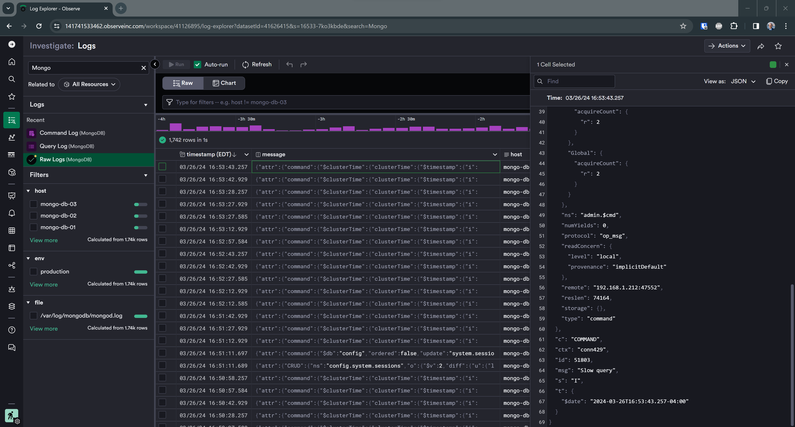

# observe-mongo-vector

Instructions on setting up ingest of self-managed mongodb metrics and logs into Observe (using vector agent)

## Background

Self-managed (installed on a Linux server) MongoDB database emits logs and metrics, which can be picked up and forwarded to Observe. In Observe, OPAL be applied to tranform incoming data into individual datasets, such as metrics, logs, SQL queries, etc.

## Configure vector agent to forward MongoDB logs and metrics to Observe

Here is a sample configuration of the vector agent to send data to Observe (in `/etc/vector/vector.yaml`):

```yaml
sources:
  mongo_metrics:
    type: mongodb_metrics
    endpoints:
      - mongodb://mongo-db-01:27017
  mongodb_logs:
    type: file
    include:
      - /var/log/mongodb/*.log

transforms:
  logs_transform:
    type: remap
    inputs:
      - mongodb_logs
    source: |-
      .tags.observe_env = "production"
      .tags.observe_host = "mongo-db-01"
      .tags.observe_datatype = "vector_logs"
  mongo_metrics_transform:
    type: remap
    inputs:
      - mongo_metrics
    source: |-
      .tags.observe_env = "production"
      .tags.observe_host = "mongo-db-01"
      .tags.observe_datatype = "vector_mongo_metrics"

sinks:
  observe_metrics:
    type: prometheus_remote_write
    inputs:
      - mongo_metrics_transform
    endpoint: >-
      https://{ CUSTOMER_ID }.collect.observeinc.com/v1/prometheus
    auth:
      strategy: bearer
      token: { METRICS_DATASTREAM_TOKEN }
    healthcheck: false
    request:
      retry_attempts: 5
  observe_logs:
    type: http
    inputs:
      - logs_transform
    encoding:
      codec: json
    uri: >-
      https://{ CUSTOMER_ID }.collect.observeinc.com/v1/http
    auth:
      strategy: bearer
      token: { LOGS_DATASTREAM_TOKEN }
```

**Notes**:

- This is a partial configuration that only collects MongoDB logs and metrics. You are at liberty to add other sources, transforms and sinks as needed.
- For details on MongoDB metrics, check out [Vector MongoDB source documentation](https://vector.dev/docs/reference/configuration/sources/mongodb_metrics/)
- For details on Log collection, check out [Vector File source documentation](https://vector.dev/docs/reference/configuration/sources/file/)

## Troubleshooting

### MongoDB Log Permissions

By default, MongoDB writes into `/var/log/mongodb/` directory, with individual files owned by the user and group `mongodb` and permissions of `600`

```sh
$ ls -lh /var/log/mongodb/*
-rw------- 1 mongodb mongodb 179M Mar 26 16:08 /var/log/mongodb/mongod.log
```

The vector agent is ran by systemd under the unprivileged user and group `vector`. This means, that it under default config, it doesn't have access to mongodb log files. There are several ways to potentially address this issue, but the quickest (although arguably not the most secure) way of doing it is by reconfiguring the vector service to run as root. You can do that by modifying `User` and `Group` settings in the vector systemd unit in `/lib/systemd/system/vector.service` to `root` instead of `vector` like so:

```toml
[Unit]
Description=Vector
Documentation=https://vector.dev
After=network-online.target
Requires=network-online.target

[Service]
User=root
Group=root
ExecStartPre=/usr/bin/vector validate
ExecStart=/usr/bin/vector
ExecReload=/usr/bin/vector validate
ExecReload=/bin/kill -HUP $MAINPID
Restart=always
AmbientCapabilities=CAP_NET_BIND_SERVICE
EnvironmentFile=-/etc/default/vector
# Since systemd 229, should be in [Unit] but in order to support systemd <229,
# it is also supported to have it here.
StartLimitInterval=10
StartLimitBurst=5
[Install]
WantedBy=multi-user.target
```

## Sample OPAL Pipelines

### Metrics

```js
filter OBSERVATION_KIND = "prometheus" and string(EXTRA.observe_datatype) = "vector_mongo_metrics"

pick_col
  BUNDLE_TIMESTAMP,
  timestamp:timestamp_ms(int64(FIELDS.timestamp)),
  metric:string(EXTRA.__name__),
  value:float64(FIELDS.value),
  tags:int64(EXTRA.micros),
  engine:string(EXTRA.engine),
  mode:string(EXTRA.mode),
  state:string(EXTRA.state),
  type:string(EXTRA.type),
  env:string(EXTRA.observe_env),
  host:string(EXTRA.observe_host)

filter not is_null(metric) and not is_null(value) and value < float64("inf")

//make_col concat_metric:concat_strings(metric, "_", engine, "_", mode, "_", state, "_", type)
make_col metric: if(is_null(engine), metric, concat_strings(metric, "_", engine))
make_col metric: if(is_null(mode), metric, concat_strings(metric, "_", mode))
make_col metric: if(is_null(state), metric, concat_strings(metric, "_", state))
make_col metric: if(is_null(type), metric, concat_strings(metric, "_", type))
make_col metric: lower(metric)
drop_col engine, mode, state, type

make_col metric: if(contains(metric, "histogram"), concat_strings(metric, "_bucket"), metric)
make_col tags:if(not is_null(tags), make_object(le:tags), make_object())

make_col type: case(
  contains(metric, "histogram"), "histogram",
  contains(metric, "total"), "cumulativeCounter",
  true, "gauge"
)

make_col unit: case(
  contains(metric, "seconds"), "seconds",
  contains(metric, "bytes"), "bytes"
)


set_valid_from options(max_time_diff:duration_min(10)), timestamp
drop_col BUNDLE_TIMESTAMP

interface "metric",  metricType: type, metricUnit: unit
```

This will auto-populate the collected mongo metrics in the Observe Metrics Explorer:


### Raw Logs

**Notes:**

- The following OPAL assumes raw datastream collecting vector log data. If you already have a log data transformation pipeline, adjust the following OPAL accordingly:

```js
filter OBSERVATION_KIND = "http" and string(FIELDS.tags.observe_datatype) = "vector_logs"

pick_col
  BUNDLE_TIMESTAMP,
  message:parse_json(string(FIELDS.message)),
  file:string(FIELDS.file),
  host:string(FIELDS.tags.observe_host),
  env:string(FIELDS.tags.observe_env)

filter file ~ mongodb

make_col timestamp:parse_isotime(string(message.t['$date']))
set_valid_from options(max_time_diff:duration_min(15)), timestamp
drop_col BUNDLE_TIMESTAMP

pick_col
  timestamp,
  message,
  host,
  env,
  file

interface "log"
```

This will give you raw logs that can further shaped into Slow Query, Command, and other types of MongoDB logs as appropriate:


